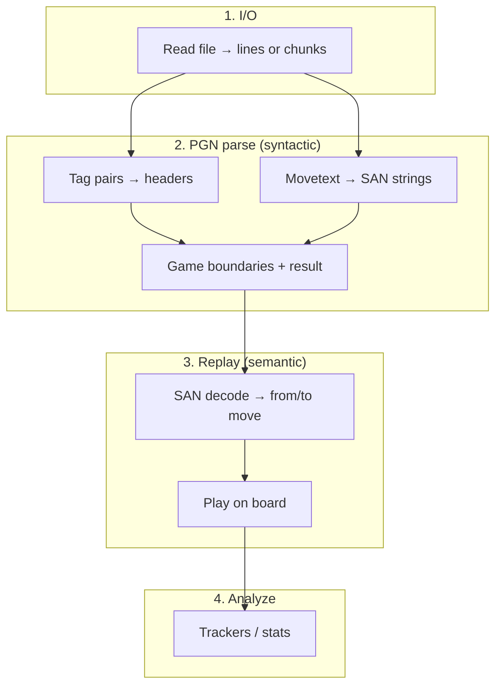

A JavaScript library for batch analyzing chess games.

[](https://badge.fury.io/js/chessalyzer.js)

# Index

- [Features](#features)
- [Installation](#installation)
- [How it works](#how-it-works)
- [Pipeline](#pipeline)
    - [Performance tiers](#performance-tiers)
- [Examples](#examples)
    - [Basic Usage](#basic-usage)
    - [Filtering](#filtering)
    - [Compare Analyses](#compare-analyses)
    - [Multithreading](#multithreaded-analysis)
    - [Error handling](#error-handling)
- [Heatmap analysis functions](#heatmap-analysis-functions)
- [Tracked statistics](#tracked-statistics)
    - [Built-in](#built-in)
    - [Custom Tracker](#custom-trackers)
- [Heatmap presets](#heatmap-presets)
- [Visualisation](#visualisation)

# Features

- Batch process PGN files and track statistics of your games
- Filter games (e.g. only analyze games where WhiteElo > 1800)
- Fully modular, track only the stats you need to preserve performance
- Generate heatmaps out of the generated data
- It's fast and highly parallelized: Processes ~25M moves/s on an Apple M1 (PGN parse only; no board replay or validation)
- Handles big files easily
- Just one dependency (chalk)

# Installation

1. Install package

```sh
npm install chessalyzer.js
```

2. Import the library:

```javascript
import { analyzePGN, printHeatmap, TileTracker } from 'chessalyzer.js';
```

3. Use the library. See next chapters for examples.

```javascript
const result = await analyzePGN('<pathToPgnFile>', { trackers: [new TileTracker()] });
console.log(result.games, result.moves, result.movesPerSecond);
```

4. Check out the examples or the [docs](https://yschroe.github.io/chessalyzer.js/).

# How it works

Chessalyzer.js runs **PGN parse**, optional **replay**, and **analyze** (trackers) over each game. See [Pipeline](#pipeline) for stage definitions. The main entry points are `analyzePGN` (batch analysis) and `printHeatmap` (terminal preview). Move trackers receive move-level `Action[]` data; game trackers receive header fields. Statistics accumulate in place on each tracker instance.

# Pipeline

Processing a PGN file follows four semantic stages. Worker **chunking** (byte-sized batches aligned to game boundaries) is parallel I/O for multithreaded mode — not a separate stage.



| Term                    | Meaning                                                                 | Position-dependent? |
| ----------------------- | ----------------------------------------------------------------------- | ------------------- |
| **I/O** / **streaming** | Read bytes from disk; deliver lines or worker chunks                    | No                  |
| **PGN parse**           | Structural parse: headers + mainline SAN **strings** + result; no board | No                  |
| **SAN decode**          | One SAN string → concrete move (`from`/`to`) using live board           | Yes                 |
| **Play**                | Apply decoded move to board state                                       | Yes                 |
| **Replay**              | SAN decode + play through a game's mainline                             | Yes                 |
| **Analyze**             | Run game/move trackers and aggregate stats                              | Depends             |

**Industry note:** “PGN parser” means stage 2 only (cf. chessops `parsePgn`). Raw file → legal moves requires **PGN parse + replay**.

Internally today: I/O uses `readLines` / `readPgnChunks`; PGN parse uses `GameAssembler` and `movetext` (`parseHeaders` for tag pairs); replay uses `GameReplayer`, `SanApplier`, and `SanToActions`; analyze is `analyzePGN` with trackers. A standalone `parsePGN` export is planned for v4 (Sprint 11).

### Performance tiers

Benchmark scripts (e.g. `bench/exploratory/profile-bottlenecks-node.ts`) measure these tiers on a large Lichess fixture:

| Tier | Label                   | Measures                                   |
| ---- | ----------------------- | ------------------------------------------ |
| 0    | Raw I/O                 | MB/s read                                  |
| 1    | Line I/O                | lines/s                                    |
| 2    | PGN parse               | games/s, moves/s (SAN strings)             |
| 2h   | PGN parse + headers     | same with tag pairs                        |
| 3    | Replay (trust, board)   | moves/s, board-only replay path            |
| 3a   | Replay (trust, actions) | moves/s, with `Action[]` for move trackers |
| 4    | Analyze E2E             | `analyzePGN` moves/s with/without trackers |
| —    | Parallel overhead       | chunk size × workers (not a semantic tier) |

Count-only runs (no move trackers) skip board replay by default; tier-2 move counts can therefore exceed tier-3 when replay is skipped.

# Examples

## Basic Usage

Let's start with a basic example. Here we simply want to track the tile occupation (=how often did each tile have a piece on it) for the whole board. For this we can use the preconfigured TileTracker class from the library. Afterwards we want to create a heatmap out of the data to visualize the tile occupation. For this basic heatmap a preset is also provided:

```javascript
import { analyzePGN, printHeatmap, TileTracker } from 'chessalyzer.js';

const tileTracker = new TileTracker();

const result = await analyzePGN('<pathToPgnFile>', { trackers: [tileTracker] });

const heatmapData = tileTracker.generateHeatmap('TILE_OCC_ALL');

printHeatmap(heatmapData);
```

## Filtering

You can also filter the PGN file for specific criteria, e.g. only evaluate games where `WhiteElo > 2000`:

```javascript
await analyzePGN('<pathToPgnFile>', {
    trackers: [tileTracker],
    filter: (game) => Number(game.WhiteElo) > 2000,
});
```

## Compare Analyses

You can also generate a comparison heat map where you can compare the data of two different analyses. Let's say you wanted to compare how the white player occupates the board between a lower rated player and a higher rated player. To get comparable results 1000 games of each shall be evaluated:

```javascript
const tileT1 = new TileTracker();
const tileT2 = new TileTracker();

await analyzePGN('<pathToPgnFile>', {
    runs: [
        {
            trackers: [tileT1],
            filter: (game) => Number(game.WhiteElo) > 2000,
            maxGames: 1000,
        },
        {
            trackers: [tileT2],
            filter: (game) => Number(game.WhiteElo) < 1200,
            maxGames: 1000,
        },
    ],
});

let func = (data, loopSqrData) => {
    const { coords } = loopSqrData;
    let val = data.tiles[coords[0]][coords[1]].w.wasOn;
    val = (val * 100) / data.movesTotal;
    return val;
};

// Generate the comparison heatmap.
const heatmapData = tileT1.generateComparisonHeatmap(tileT2, func);

// Use heatmapData.
```

## Multithreaded analysis

By default chessalyzer.js uses Node.js [Worker Threads](https://nodejs.org/api/worker_threads.html) to stream the PGN file via I/O and analyze data in parallel.

```javascript
await analyzePGN('<pathToPgnFile>', {
    trackers: [tileTracker],
    maxGames: 10000,
    workers: { targetBytes: 4 * 1024 * 1024 },
});
```

By default, `analyzePGN` uses Node.js [Worker Threads](https://nodejs.org/api/worker_threads.html) and byte-sized PGN chunks aligned to game boundaries.

### Single-threaded mode

```javascript
await analyzePGN('<pathToPgnFile>', { workers: false });
```

## Error handling

By default, `analyzePGN` **aborts on the first replay failure** (illegal or unparseable SAN). The library does not log to the console — callers decide how to handle errors:

```javascript
import { analyzePGN, getAnalyzeError, isReplayError } from 'chessalyzer.js';

try {
    await analyzePGN('<pathToPgnFile>');
} catch (err) {
    const analyzeError = getAnalyzeError(err);
    if (isReplayError(analyzeError)) {
        console.error(
            `Game ${analyzeError.gameIndex}, move ${analyzeError.moveIndex}: ${analyzeError.san}`,
        );
    }
    throw err;
}
```

For large batch runs over mostly trusted exports (e.g. Lichess database dumps), use `onError: 'skip-game'` to continue past bad games and collect a summary:

```javascript
const result = await analyzePGN('<pathToPgnFile>', { onError: 'skip-game' });
console.log(result.games, result.skippedGames, result.errors);
```

`result.errors` contains up to 100 typed replay errors (`gameIndex`, `moveIndex`, `san`, `reason`). Use default `abort` for untrusted or small inputs where a failure should stop the run immediately.

##### Important

To use a custom tracker with your multithreaded analysis please see the important notes at the [Custom Trackers](#custom-trackers) section.

# Heatmap generation functions

The function you create for heatmap generation gets passed up to four parameters (inside `generateHeatmap(...)`):

1. `data`: The data that is the basis for the heatmap. Per default this data is the Tracker you called the `generateHeatmap(...)` function from itself.
2. `loopSqrData`: Contains informations about the square the current heatmap value shall be calculated for. The `generateHeatmap(...)` function loops over every square of the board to calculate a heat map value for each tile. `sqrData` is an object with the following entries:

    ```typescript
    interface SquareData {
        // The square in algebraic notation (e.g. 'a2').
        alg: string;

        // The square in board coordinates (e.g. [6,0]).
        coords: number[];

        // The piece that starts at the passed square. If no piece starts at the passed square, piece is null.
        piece: {
            // Name of the piece (e.g. 'Pa' for the a-pawn).
            name: string;
            // Color of the piece ('b' or 'w').
            color: string;
        };
    }
    ```

3. `sqrData`: Contains informations about the square you passed into the `generateHeatmap()` function. The structure of `sqrData` is the same as of `loopSqrData`. You'll need this for extracting the values for the square / piece you are interested in. For example if you want to generate a heatmap for white's a pawn, the square for `sqrData` would be 'a2' (= starting position of the white a pawn).

4. `optData`: Optional data you may need in this function. For example, if you wanted to generate a heatmap to show the average position of a piece after X moves, you could pass that 'X' here.

# Tracked statistics

## Built-in

chessalyzer.js comes with three built-in trackers, which can be directly imported into your script:

`GameTracker`:

- `results`
  An object which counts the results of the tracked games. Contains the keys `white`, `draw` and `black`

- `ECO`
  Counts the ECO keys of the processed games. `ECO` is an object that contains the different keys, for example 'A00'.

- `games`  
  Number of games processed

`PieceTracker`:

- `b`  
  Blacks pieces. Tracks how often a specific black piece took a specific white piece. E.g. `b.Pa.Qd` tracks how often the black a-pawn took whites queen.

- `w`  
  Same for whites pieces.

`TileTracker`:

- `tiles[][]`  
  Represents the tiles of the board. Has two objects (`b`, `w`) on the first layer, and then each piece inside these objects as a second layer (`Pa`, `Ra` etc.). For each piece following stats are tracked:
    - `movedTo`: How often the piece moved to this tile
    - `wasOn`: Amount of half-moves the piece was on this tile
    - `capturedOn`: How often the piece captured another piece on this tile
    - `wasCapturedOn`: How often the piece was captured on this tile

    These stats are also tracked for black and white as a whole. Simply omit the piece name to get the total stats of one side for a specific tile, e.g. `tiles[0][6].b.wasOn`.

- `movesTotal`: Amount of moves processed in total.

## Custom Trackers

Derive from `MoveTracker` (move-level) or `GameTrackerBase` (game-level). For multithreaded analysis, custom trackers must live in a **separate module** and follow this contract:

1. **Default export** — the tracker class
2. **`static trackerId = 'YourUniqueId'`** — stable ID (minification-safe; used to match worker instances)
3. **`static workerModule = import.meta.url`** — so workers can import your module
4. **`merge(tracker)`** — combine worker batch stats into the main-thread instance (duck-type the argument; do not use `instanceof` — worker payloads are plain objects)

See [`manual-tests/custom-game-tracker.ts`](manual-tests/custom-game-tracker.ts) for a minimal game-level example.

- `track(data)`: called per half-move (`Action[]`) or per game (`Game` with headers + `moves`)
- `merge(tracker)`: required for multithreading (see example below)

Example skeleton:

```javascript
export default class MyTracker extends GameTrackerBase {
    static trackerId = 'MyTracker';
    static workerModule = import.meta.url;

    merge(tracker) {
        /* aggregate batch stats */
    }
    trackGame(game) {
        /* ... */
    }
}
```

Example merge for the built-in GameTracker:

```javascript
merge(tracker) {
    this.results.white += tracker.results.white;
    this.results.black += tracker.results.black;
    this.results.draw += tracker.results.draw;
    this.games += tracker.games;
    this.time += tracker.time;
}
```

# Heatmap Presets

Instead of defining your own heatmap function you can also use the heatmap presets chessalyzer.js provides you via the Tile and Piece Trackers. You can access those presets by passing the SHORT_NAMEs of the following table as your first argument in `generateHeatmap(...)`, e.g. `<yourTileTrackerInstance>.generateHeatmap('TILE_OCC_BY_PIECE', 'a2')`.

### Tile Tracker

| Short Name          | Long Name                         | Scope         | Description                                                                                                                                                                           |
| ------------------- | --------------------------------- | ------------- | ------------------------------------------------------------------------------------------------------------------------------------------------------------------------------------- |
| TILE_OCC_ALL        | Tile Occupation All               | global        | Calculates how often each tile of the board had any piece on it (as a percentage of all moves)                                                                                        |
| TILE_OCC_WHITE      | Tile Occupation (White Pieces)    | global        | Calculates how often each tile of the board had a white piece on it (as a percentage of all moves)                                                                                    |
| TILE_OCC_BLACK      | Tile Occupation (Black Pieces)    | global        | Calculates how often each tile of the board had a black piece on it (as a percentage of all moves)                                                                                    |
| TILE_CAPTURE_COUNT  | Tile Capture Count                | global        | Count of Pieces that were captured on each tile.                                                                                                                                      |
| TILE_OCC_BY_PIECE   | Tile Occupation for selected Tile | Tile specific | Calculates how often the passed tile was occupated by each piece on the board. The values are shown at the starting position of each piece.                                           |
| PIECE_MOVED_TO_TILE | Target squares for selected Piece | Tile specific | Shows how often the piece that starts at the selected tile moved to each tile of the board. Only makes sense for tiles with a piece on it at the start of the game (Rank 1,2,7 and 8) |

### Piece Tracker

| Short Name        | Long Name | Scope          | Description                                                                                                                                                  |
| ----------------- | --------- | -------------- | ------------------------------------------------------------------------------------------------------------------------------------------------------------ |
| PIECE_CAPTURED_BY |           | Piece specific | Shows how often the piece that starts at the passed tile was captured by other pieces. The values are shown at the starting position of each opposing piece. |
| PIECE_CAPTURED    |           | Piece specific | Shows how often the piece that starts at the passed tile captured other pieces. The values are shown at the starting position of each opposing piece.        |

# Visualisation

For a quick preview you can put your heatmap data into `printHeatmap(...)` to see your heatmap in the terminal if it supports color:


But generally chessalyzer.js only provides the raw data of the analyses (yet? :)). If you want to visualize the data you will need a separate library. The following examples were created with my fork of [chessboard.js](https://github.com/PeterPain/heatboard.js) with added heatmap functionality.

White tile occupation  


Moves of whites e pawn  


Difference of whites tiles occupation between a higher (green) and a lower rated (red) player  

