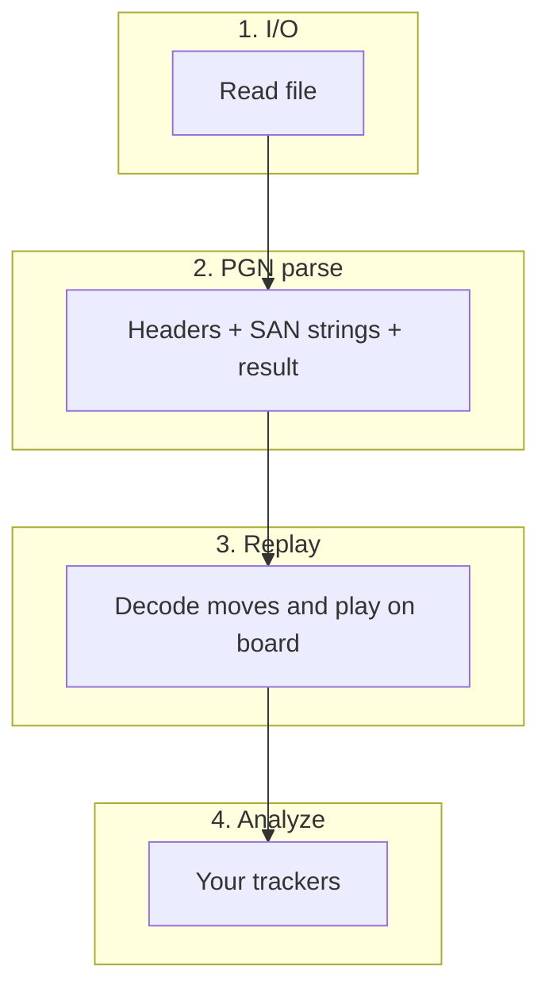

# Chessalyzer

A JavaScript library for batch analyzing chess games.

[](https://badge.fury.io/js/chessalyzer)

# Index

- [Features](#features)
- [Installation](#installation)
- [How it works](#how-it-works)
- [Pipeline](#pipeline)
- [Examples](#examples)
    - [Basic Usage](#basic-usage)
    - [Filtering](#filtering)
    - [Compare Analyses](#compare-analyses)
    - [Multithreading](#multithreaded-analysis)
    - [Error handling](#error-handling)
- [Heatmap analysis functions](#heatmap-analysis-functions)
- [Tracked statistics](#tracked-statistics)
    - [Built-in](#built-in)
    - [Custom Tracker](#custom-trackers)
- [Heatmap presets](#heatmap-presets)
- [Visualisation](#visualisation)

# Features

- Batch process PGN files and track statistics of your games
- Filter games (e.g. only analyze games where WhiteElo > 1800)
- Fully modular, track only the stats you need to preserve performance
- Generate heatmaps out of the generated data
- It's fast and highly parallelized: Processes ~20M moves/s on an Apple M1 (PGN parse only; no board replay or validation)
- Handles big files easily
- Zero production dependencies

# Installation

1. Install package

```sh
npm install chessalyzer
```

2. Import the library:

```javascript
import { analyzePGN, printHeatmap } from 'chessalyzer';
import { TileTracker } from 'chessalyzer/trackers';
```

3. Use the library. See next chapters for examples.

```javascript
const result = await analyzePGN('<pathToPgnFile>', { trackers: [new TileTracker()] });
console.log(result.gameCount, result.moveCount, result.movesPerSecond);
```

4. Check out the examples or the [docs](https://yschroe.github.io/chessalyzer/).

# How it works

Give chessalyzer a PGN file and it takes care of the boring parts: reading the file, understanding each game, and replaying every move on an internal board. Along the way, your trackers collect exactly the statistics you asked for — nothing more, which is what keeps it fast. When the run finishes, the results are right where you left them: on the tracker instances you passed in.

The main entry points are `analyzePGN` (batch analysis) and `printHeatmap` (a quick terminal preview). Move trackers receive per-move data; game trackers receive header fields like player names and ratings. See [Pipeline](#pipeline) if you want to dig into the stages.

# Pipeline

Every PGN file goes through four steps:

1. **I/O** — read the file from disk (as lines, or as byte-sized chunks in multithreaded mode).
2. **PGN parse** — extract headers, mainline move strings (SAN), and game results. No board involved yet — this is the fastest step if you just want the raw game data.
3. **Replay** — decode each SAN string and play it on an internal board. Needed whenever your trackers care about _where_ pieces are, not just _what_ was played.
4. **Analyze** — run your trackers and accumulate statistics.

When people say "PGN parser," they usually mean step 2 only. Turning a file into actual legal moves takes **PGN parse + replay**.



You can stop after PGN parse if you do not need board replay, or run the full pipeline with `analyzePGN`:

```javascript
import { analyzePGN } from 'chessalyzer';
import { parsePGN, streamParsePGN } from 'chessalyzer/pgn';
import { GameTracker } from 'chessalyzer/trackers';

// Just the games — no board replay
const games = await parsePGN('<pathToPgnFile>', { headers: true, maxGames: 100 });
// games[0].moves — mainline {@link ParsedMove} objects (`move.san` is the SAN token)

// Same, but one game at a time (easier on memory for huge files)
for await (const game of streamParsePGN('<pathToPgnFile>', { headers: true })) {
    // game.moves[i].san — mainline SAN strings
}

// Full pipeline
await analyzePGN('<pathToPgnFile>', {
    trackers: [new GameTracker()],
    headers: true,
    replay: 'board', // 'skip' | 'board' | 'actions' — move trackers need 'actions'
    validation: 'trust',
});
```

Set `headers: true` when your filter reads tag pairs like `WhiteElo`. By default, headers are parsed automatically when you use a game tracker (`'auto'`).

Count-only runs (no move trackers) skip board replay by default, which makes them noticeably faster. Benchmark scripts live in `bench/` if you want to measure things yourself.

# Examples

## Basic Usage

Let's start with a basic example. Here we simply want to track the tile occupation (=how often did each tile have a piece on it) for the whole board. For this we can use the preconfigured TileTracker class from the library. Afterwards we want to create a heatmap out of the data to visualize the tile occupation. For this basic heatmap a preset is also provided:

```javascript
import { analyzePGN, printHeatmap } from 'chessalyzer';
import { TileTracker } from 'chessalyzer/trackers';

const tileTracker = new TileTracker();

const result = await analyzePGN('<pathToPgnFile>', { trackers: [tileTracker] });

const heatmapData = tileTracker.generateHeatmap('TILE_OCC_ALL');

printHeatmap(heatmapData);
```

## Filtering

You can filter games with a plain JavaScript function — for example, only analyze games where `WhiteElo > 2000` (set `headers: true` when your filter reads tag pairs):

```javascript
await analyzePGN('<pathToPgnFile>', {
    workers: false,
    trackers: [tileTracker],
    headers: true,
    filter: (game) => Number(game.headers?.WhiteElo) > 2000,
});
```

Filters are regular JS callbacks, so they need to run on the main thread. Pass `workers: false` when you use a filter — the library will let you know if you forget.

## Compare Analyses

You can also generate a comparison heat map where you can compare the data of two different analyses. Let's say you wanted to compare how the white player occupates the board between a lower rated player and a higher rated player. To get comparable results 1000 games of each shall be evaluated:

```javascript
const tileT1 = new TileTracker();
const tileT2 = new TileTracker();

await analyzePGN('<pathToPgnFile>', {
    workers: false,
    headers: true,
    runs: [
        {
            trackers: [tileT1],
            filter: (game) => Number(game.headers?.WhiteElo) > 2000,
            maxGames: 1000,
        },
        {
            trackers: [tileT2],
            filter: (game) => Number(game.headers?.WhiteElo) < 1200,
            maxGames: 1000,
        },
    ],
});

let func = (data, loopSqrData, _sqrData) => {
    const { square } = loopSqrData;
    const row = 7 - (square.charCodeAt(1) - 49);
    const col = square.charCodeAt(0) - 97;
    let val = data.tiles[row][col].w.wasOn;
    val = (val * 100) / data.movesTotal;
    return val;
};

// Generate the comparison heatmap.
const heatmapData = tileT1.generateComparisonHeatmap(tileT2, func);

// Use heatmapData.
```

## Multithreaded analysis

By default, chessalyzer uses Node.js [Worker Threads](https://nodejs.org/api/worker_threads.html) to read and analyze your PGN in parallel. You do not need to configure anything — it just works:

```javascript
await analyzePGN('<pathToPgnFile>', {
    trackers: [tileTracker],
    maxGames: 10000,
    workers: { targetBytes: 4 * 1024 * 1024 },
});
```

The `workers` option lets you tune chunk size if you want; the defaults are fine for most files.

### Single-threaded mode

If you need everything on the main thread (for example when using a `filter`), pass `workers: false`:

```javascript
await analyzePGN('<pathToPgnFile>', { workers: false });
```

## Error handling

What happens when a game in your file has a broken or illegal move? You have two choices.

**Stop immediately** (the default) — great while developing or on small, trusted files. The run throws on the first replay failure, and you can inspect exactly which game and move caused it:

```javascript
import { analyzePGN, getAnalyzeError, isReplayError } from 'chessalyzer';

try {
    await analyzePGN('<pathToPgnFile>');
} catch (err) {
    const analyzeError = getAnalyzeError(err);
    if (isReplayError(analyzeError)) {
        console.error(
            `Game ${analyzeError.gameIndex}, move ${analyzeError.moveIndex}: ${analyzeError.san}`,
        );
    }
    throw err;
}
```

**Skip bad games and keep going** — better for large batch runs over mostly good data (like Lichess database dumps):

```javascript
const result = await analyzePGN('<pathToPgnFile>', { onError: 'skip-game' });
console.log(result.gameCount, result.skippedGames, result.errors, result.errorsTruncated);
```

`result.errors` holds up to 100 typed replay errors (`gameIndex`, `moveIndex`, `san`, `reason`). If more than 100 games fail, `result.errorsTruncated` is `true`. The library never logs to the console for you — you decide what to do with the errors.

Replay assumes trustworthy PGN by default (`validation: 'trust'`).

##### Important

To use a custom tracker with your multithreaded analysis please see the important notes at the [Custom Trackers](#custom-trackers) section.

# Heatmap generation functions

The function you create for heatmap generation gets passed up to four parameters (inside `generateHeatmap(...)`):

1. `data`: Tracker state passed as the first argument to `generateHeatmap(state, ...)`.
2. `loopSqrData`: Information about the square the current heatmap value is calculated for. The `generateHeatmap(...)` function loops over every square of the board. `loopSqrData` has this shape:

    ```typescript
    import type { Square } from 'chessalyzer/replay';
    import type { SquareData } from 'chessalyzer/trackers';

    interface SquareData {
        // Interned algebraic square (e.g. 'a2').
        square: Square;

        // Starting piece on this square, or null when the square is empty initially.
        piece: {
            name: string; // e.g. 'Pa' for the a-pawn
            color: 'b' | 'w';
        } | null;
    }
    ```

3. `sqrData`: Contains informations about the square you passed into the `generateHeatmap()` function. The structure of `sqrData` is the same as of `loopSqrData`. You'll need this for extracting the values for the square / piece you are interested in. For example if you want to generate a heatmap for white's a pawn, the square for `sqrData` would be 'a2' (= starting position of the white a pawn).

4. `optData`: Optional data you may need in this function. For example, if you wanted to generate a heatmap to show the average position of a piece after X moves, you could pass that 'X' here.

# Tracked statistics

## Built-in

chessalyzer comes with three built-in trackers. Stats live on **`result.runs[n].trackers[m].state`** after `analyzePGN` returns.

`GameTracker` state:

- `results` — `white`, `draw`, `black` win counts
- `ECO` — ECO code counts (e.g. `'A00'`)
- `games` — number of games processed

`PieceTracker` state:

- `b` / `w` — capture matrices (`b.Pa.Qd` = black a-pawn took white queen)

`TileTracker` state:

- `tiles[][]`  
  Represents the tiles of the board. Has two objects (`b`, `w`) on the first layer, and then each piece inside these objects as a second layer (`Pa`, `Ra` etc.). For each piece following stats are tracked:
    - `movedTo`: How often the piece moved to this tile
    - `wasOn`: Amount of half-moves the piece was on this tile
    - `capturedOn`: How often the piece captured another piece on this tile
    - `wasCapturedOn`: How often the piece was captured on this tile

    These stats are also tracked for black and white as a whole. Simply omit the piece name to get the total stats of one side for a specific tile, e.g. `tiles[0][6].b.wasOn`.

- `movesTotal`: Amount of moves processed in total.

## Custom Trackers

Trackers separate **definition** (behavior) from **state** (plain accumulated data). Author with a factory (`defineGameTracker` / `defineMoveTracker`) or a class adapter (`extends MoveTracker` / `extends BaseGameTracker`). Pass definitions to `analyzePGN`; read stats from `result.runs[n].trackers[m].state`.

**Factory (recommended for clarity):**

```javascript
import { defineGameTracker } from 'chessalyzer/trackers';

const eloTracker = defineGameTracker({
    id: 'elo-tracker',
    workerModule: import.meta.url, // multithreaded custom trackers only
    options: { minElo: 2000 },
    init: () => ({ games: 0, wins: [0, 0, 0] }),
    track: (state, game) => {
        /* fold one game */
    },
    merge: (state, other) => {
        /* fold worker state */
    },
    finish: (state) => {
        /* optional end-of-analysis */
    },
});
```

**Class adapter:**

```javascript
export default class MyTracker extends BaseGameTracker {
    id = 'MyTracker';
    workerModule = import.meta.url;

    init() {
        return { games: 0, wins: [0, 0, 0] };
    }
    track(state, game) {
        /* called once per game */
    }
    merge(state, other) {
        /* fold worker state into main state */
    }
}
```

For multithreaded analysis, custom trackers need: **own module** with **default export**, **`id`**, **`workerModule`**, and **`merge`**. Worker state is sent as plain `{ id, state }` snapshots merged by id at pool drain.

**Multithreaded environments:** `workerModule = import.meta.url` requires an unbundled Node ≥ 22 or Bun runtime (bundlers may rewrite `import.meta.url`).

**Move trackers:** `SanDecoder` returns a reused `Action[]` buffer each half-move. Copy fields you need to retain across moves. Override **`onGameEnd(state)`** for per-game flush hooks (called after each game, including skipped games).

See [`manual-tests/custom-game-tracker.ts`](manual-tests/custom-game-tracker.ts) for a minimal working example.

Heads-up on castling: it produces two move actions (king leg, then rook leg) in one batch. The rook leg carries the same `castle` flag. `TileTracker` counts castling as one move for `movesTotal`; your move tracker can skip rook legs via `action.castle` on the second leg.

Import bases and types from their canonical subpaths:

```javascript
import type { GameFilter } from 'chessalyzer';
import type { ParsedGame, ParsedMove } from 'chessalyzer/pgn';
import type { Action, MoveAction, CaptureAction, PlayerColor, Square } from 'chessalyzer/replay';
import {
    BaseGameTracker,
    MoveTracker,
    defineGameTracker,
    defineMoveTracker,
    TileHeatmapPresets,
    type GameTrackerDef,
    type HeatmapAnalysisFunc,
    type MoveTrackerDef,
    type StateOf,
    type TrackerDef,
} from 'chessalyzer/trackers';
```

`GameTracker` merge example (state-based):

```javascript
merge(state, other) {
    state.results.white += other.results.white;
    state.results.black += other.results.black;
    state.results.draw += other.results.draw;
    state.games += other.games;
}
```

Read stats after analysis:

```javascript
const tracker = new GameTracker();
const result = await analyzePGN(path, { trackers: [tracker] });
const { state } = result.runs[0].trackers[0];
console.log(state.games, state.results);
```

# Heatmap Presets

Built-in heatmap presets are module-level maps exported from `chessalyzer/trackers` (`TileHeatmapPresets`, `PieceHeatmapPresets`) and mirrored on `TileTracker.presets` / `PieceTracker.presets`. Preset names are typed (`TileHeatmapPresetName`, `PieceHeatmapPresetName`) for autocomplete when calling `generateHeatmap(state, ...)`.

Instead of defining your own heatmap function you can pass a preset name as the second argument, e.g. `tileTracker.generateHeatmap(state, 'TILE_OCC_BY_PIECE', 'a2')`.

### Tile Tracker

| Short Name          | Long Name                         | Scope         | Description                                                                                                                                                                           |
| ------------------- | --------------------------------- | ------------- | ------------------------------------------------------------------------------------------------------------------------------------------------------------------------------------- |
| TILE_OCC_ALL        | Tile Occupation All               | global        | Calculates how often each tile of the board had any piece on it (as a percentage of all moves)                                                                                        |
| TILE_OCC_WHITE      | Tile Occupation (White Pieces)    | global        | Calculates how often each tile of the board had a white piece on it (as a percentage of all moves)                                                                                    |
| TILE_OCC_BLACK      | Tile Occupation (Black Pieces)    | global        | Calculates how often each tile of the board had a black piece on it (as a percentage of all moves)                                                                                    |
| TILE_CAPTURE_COUNT  | Tile Capture Count                | global        | Count of Pieces that were captured on each tile.                                                                                                                                      |
| TILE_OCC_BY_PIECE   | Tile Occupation for selected Tile | Tile specific | Calculates how often the passed tile was occupated by each piece on the board. The values are shown at the starting position of each piece.                                           |
| PIECE_MOVED_TO_TILE | Target squares for selected Piece | Tile specific | Shows how often the piece that starts at the selected tile moved to each tile of the board. Only makes sense for tiles with a piece on it at the start of the game (Rank 1,2,7 and 8) |

### Piece Tracker

| Short Name        | Long Name | Scope          | Description                                                                                                                                                  |
| ----------------- | --------- | -------------- | ------------------------------------------------------------------------------------------------------------------------------------------------------------ |
| PIECE_CAPTURED_BY |           | Piece specific | Shows how often the piece that starts at the passed tile was captured by other pieces. The values are shown at the starting position of each opposing piece. |
| PIECE_CAPTURED    |           | Piece specific | Shows how often the piece that starts at the passed tile captured other pieces. The values are shown at the starting position of each opposing piece.        |

# Visualisation

For a quick preview you can put your heatmap data into `printHeatmap(...)` to see your heatmap in the terminal if it supports color:


But generally chessalyzer only provides the raw data of the analyses (yet? :)). If you want to visualize the data you will need a separate library. The following examples were created with my fork of [chessboard.js](https://github.com/PeterPain/heatboard.js) with added heatmap functionality.

White tile occupation  


Moves of whites e pawn  


Difference of whites tiles occupation between a higher (green) and a lower rated (red) player  

