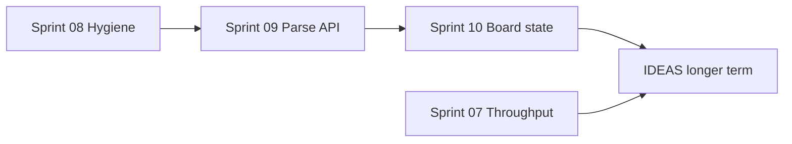

# Sprints

## Completed (v4 cleanup)

Sprints **01–06** shipped after the v4 API redesign. See [`archive/`](./archive/) for the original task lists and [CHANGELOG](../CHANGELOG.md) for what landed.

| Sprint | Theme                                                       |
| ------ | ----------------------------------------------------------- |
| 01     | Critical fixes (chunk buffer, debug logs)                   |
| 02     | Error model (`onError`, typed errors)                       |
| 03     | Worker infrastructure (`trackerId`, lazy pool)              |
| 04     | Collapse legacy MT (filter/maxGames on worker-chunk)        |
| 05     | Test coverage matrix                                        |
| 06     | Internal consistency (naming, types, replay skip, castling) |

## Active backlog

Forward-looking sprints grounded in [IDEAS.md](../IDEAS.md). Order is suggested priority; sprints can be reordered where dependencies allow.

| Sprint                                                                 | Theme                                | Effort | Impact |
| ---------------------------------------------------------------------- | ------------------------------------ | ------ | ------ |
| [07 — Throughput polish](./sprint-07-throughput-polish.md)             | Multi-run parse-once, deferred merge | Medium | High   |
| [08 — Tracker & type hygiene](./sprint-08-tracker-type-hygiene.md)     | File naming, README fixes, dedup     | Small  | Medium |
| [09 — Public parse foundation](./sprint-09-public-parse-foundation.md) | `parsePGN`, `ParsedGame`, streaming  | Large  | High   |
| [10 — Board state for validate/FEN](./sprint-10-board-state-fen.md)    | Castling rights, EP, validate prep   | Medium | Medium |

**Not in scope here:** hot-path refactors (`SanApplier` / `SanToActions` split, manual iterators, `Array.concat` patterns) — always bench before changing.

## Conventions

Each sprint file includes goal, tasks, primary files, done-when criteria, and verification steps.
