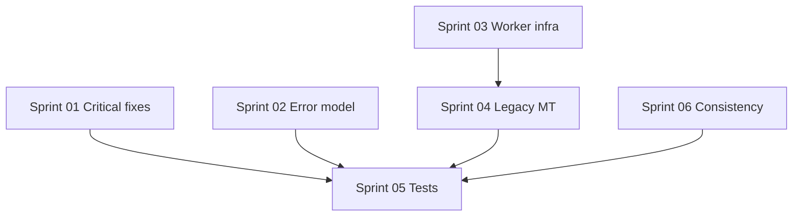

# Cleanup sprints

Forward-looking work items identified after the v4 API redesign. Each sprint is self-contained enough to pick up in a focused session. Order reflects suggested priority, but sprints can be reordered where dependencies allow.

**Not in scope here:** performance hot-path refactors (`SanApplier` / `SanToActions` split, manual iterators, `Array.concat` patterns) — those are intentional; always bench before changing.

| Sprint                                                             | Theme                             | Effort       | Impact |
| ------------------------------------------------------------------ | --------------------------------- | ------------ | ------ |
| [01 — Critical fixes](./sprint-01-critical-fixes.md)               | Bug + quick wins                  | Small        | High   |
| [02 — Error model](./sprint-02-error-model.md)                     | Library-friendly errors           | Medium       | High   |
| [03 — Worker infrastructure](./sprint-03-worker-infrastructure.md) | Registry, pool, dead fields       | Medium       | Medium |
| [04 — Collapse legacy MT](./sprint-04-collapse-legacy-mt.md)       | Filter/limit on worker-parse path | Large        | High   |
| [05 — Test coverage](./sprint-05-test-coverage.md)                 | Regression & gap filling          | Medium       | High   |
| [06 — Internal consistency](./sprint-06-internal-consistency.md)   | Naming, types, docs, replay skip  | Small–Medium | Medium |

## Dependency graph

- **Start anywhere:** Sprint 01 or 06 (no prerequisites).
- **Before Sprint 04:** Sprint 03 helps (registry + worker task cleanup).
- **Sprint 05** can run incrementally after each sprint lands relevant tests.

## Conventions

Each sprint file includes:

- **Goal** — one sentence
- **Tasks** — checkboxes
- **Files** — primary touch points
- **Done when** — acceptance criteria
- **Bench / test** — verification steps
