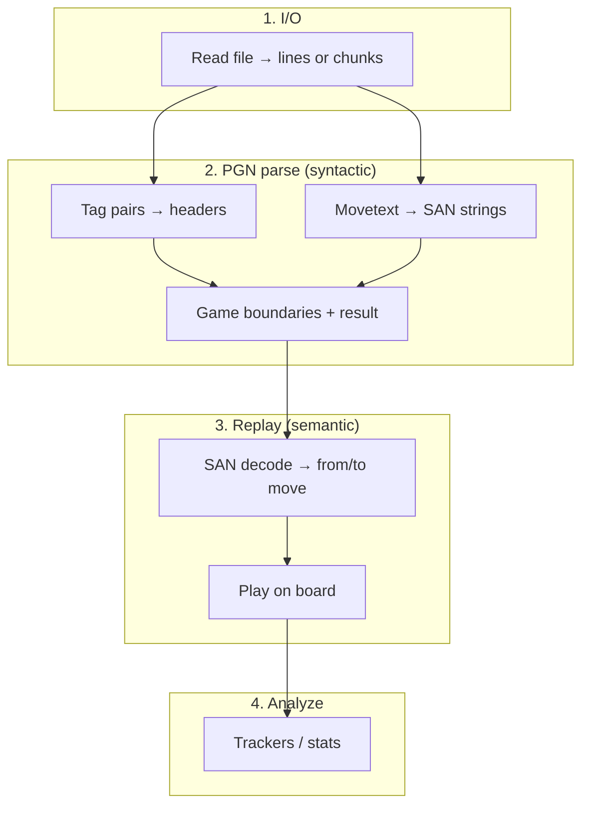

# Sprint 11 — Pipeline terminology & v4 API

**Effort:** Large (multiple sessions)  
**Impact:** High — public vocabulary, module boundaries, and benchmark story for v4  
**Depends on:** Sprint 08 helpful but not required  
**Blocks:** [Sprint 09](./sprint-09-public-parse-foundation.md) (absorbs and replaces its naming/API tasks)

## Goal

Align code, public API, and docs with standard chess PGN pipeline terminology. v4 (currently in dev) may break names and exports before release; behavior and throughput should stay equivalent unless a rename forces a measurable fix.

The library should read as four explicit stages:



**Not a semantic stage:** worker **chunking** — parallel dispatch on top of I/O (document in README; keep implementation in the I/O layer).

---

## Canonical glossary (v4)

Use these terms in code comments, public docs, CHANGELOG, and benchmark output. Do not use “tokenize” for SAN extraction or “parse” for SAN decode.

| Term                    | Meaning                                                                 | Position-dependent? | Primary modules                                        |
| ----------------------- | ----------------------------------------------------------------------- | ------------------- | ------------------------------------------------------ |
| **I/O** / **streaming** | Read bytes from disk; deliver lines or transferable chunks              | No                  | `line-reader`, `pgn-chunks`                            |
| **PGN parse**           | Structural parse: headers + mainline SAN **strings** + result; no board | No                  | `game-assembler`, `movetext`                           |
| **SAN decode**          | One SAN string → concrete move (`from`/`to`) using live board           | Yes                 | `san-decoder` (today `san-to-actions`), `piece-finder` |
| **Play**                | Apply decoded move to board state                                       | Yes                 | `san-applier`, `chess-board`                           |
| **Replay**              | SAN decode + play through a game's mainline                             | Yes                 | `game-replayer`, replay policy                         |
| **Analyze**             | Run game/move trackers and aggregate stats                              | Depends             | `core`, `tracker`                                      |

**Pipeline terminology:** “PGN parser” = stage 2 only (syntactic parse to SAN strings and headers; no board). Full “raw file → legal moves” = **PGN parse + replay**, not “parser” alone.

**Validation** is a **mode** (`trust` | `validate`), not a pipeline stage. v4 ships `trust` only; validate remains future work (Sprint 10+).

---

## Public API target (v4)

### Entry points

| Export                                         | Stage(s)  | Purpose                                |
| ---------------------------------------------- | --------- | -------------------------------------- |
| `readLines`, `readPgnChunks`                   | 1         | Streaming I/O (advanced / large files) |
| `parsePGN`                                     | 2         | Public syntactic parse; no board       |
| `replayGame` / internal use via `GameReplayer` | 3         | Decode + play one `ParsedGame`         |
| `analyzePGN`                                   | 2 + 3 + 4 | Current main entry; composes the above |

Optional subpath exports (package.json `exports`):

- `chessalyzer/io` — stage 1
- `chessalyzer/pgn` — stage 2 types + `parsePGN`
- `chessalyzer/replay` — stage 3 types + replay policy helpers
- `chessalyzer` — `analyzePGN`, trackers, errors

### Types & options

```ts
// Stage 2 output (rename from internal Game where appropriate)
interface ParsedGame {
    moves: string[]; // mainline SAN strings
    result?: string;
    [header: string]: string | string[] | undefined;
}

interface ParsePgnOptions {
    /** Parse tag-pair headers into ParsedGame fields. Default: false. */
    headers?: boolean;
    maxGames?: number;
    /** Worker chunk config when streaming via pool — internal to analyzePGN for now. */
}

interface AnalyzePgnOptions extends ParsePgnOptions {
    trackers?: Tracker[];
    /** Replay mode. Default inferred from trackers (see resolveReplayMode). */
    replay?: ReplayMode;
    workers?: false | { targetBytes?: number };
    onError?: 'abort' | 'skip-game';
}

/** What replay produces — not whether parsing runs. */
type ReplayMode = 'skip' | 'board' | 'actions';
```

Replace overloaded / misleading names:

| Pre-sprint / legacy names | v4 target                                                 |
| ------------------------- | --------------------------------------------------------- |
| `readInHeader`            | `headers` (parse option) / `parseHeaders` (internal flag) |
| `parseOnly` (worker)      | `pgnParseOnly`                                            |
| `ReplayPolicy 'none'`     | `ReplayMode 'board'`                                      |
| `SanToActions.parse(san)` | `SanDecoder.decodeSan(san)` (or module-level `decodeSan`) |
| `tokenize` (docs/bench)   | **PGN parse**                                             |
| “read-in” (README)        | **I/O** / **streaming**                                   |

---

## Implementation plan

### Phase 1 — Docs & benchmark vocabulary (no behavior change)

- [x] **Add “Pipeline” section to README**
    - Glossary table above
    - Mermaid diagram
    - Benchmark tier table (see [Benchmark tiers](#benchmark-tiers-v4))
- [x] **Rewrite AGENTS.md pipeline section** — replace “tokenize/assemble” wording with I/O → PGN parse → replay → analyze
- [x] **Update IDEAS.md** — replace `tokenize` tier with **PGN parse**; note Sprint 11 as source of truth for naming
- [x] **Rename bench stages** in [`bench/exploratory/profile-bottlenecks-node.ts`](../bench/exploratory/profile-bottlenecks-node.ts)
    - `stageTokenize` → `stagePgnParse`
    - Console labels: “PGN parse (no hdr)” / “PGN parse (+ hdr)”
- [x] **Add v4 migration appendix to CHANGELOG** (breaking rename table for pre-release API)

### Phase 2 — PGN parse layer renames

- [x] **Rename file** [`movetext-tokenizer.ts`](../src/pgn/movetext-tokenizer.ts) → `movetext.ts`
    - Update all imports (`#pgn/movetext`)
    - File header: “movetext helpers for PGN parse (SAN extraction, comments, results)”
- [x] **Rename options on assembler**
    - `ParseGamesOptions.readInHeader` → `parseHeaders: boolean`
    - Keep `parseGamesFromLines` and `GameAssembler` (pipeline-aligned naming)
- [x] **Optional clarity renames** (same file, same hot path — bench if touching loops):
    - `extractMoves` → `extractSanFromLine` (or keep `extractMoves` with updated JSDoc: “extract SAN tokens from one movetext line”)
- [x] **Worker / config wiring**
    - `readInHeader` → `parseHeaders` in [`analysis-config.ts`](../src/core/analysis-config.ts), [`worker.ts`](../src/types/worker.ts), [`game-processor.ts`](../src/core/game-processor.ts), [`chess-worker.ts`](../src/core/chess-worker.ts)
    - `parseOnly` → `pgnParseOnly`
    - `parsedGames` → keep or rename to `assembledGames` (prefer **`parsedGames`** — matches “PGN parse” output)

### Phase 3 — Replay layer renames

- [x] **Replay mode type**
    - `ReplayPolicy` → `ReplayMode`
    - Values: `'skip' | 'board' | 'actions'` (`'none'` → `'board'`)
    - `resolveReplayPolicy` → `resolveReplayMode`
    - File: [`replay-mode.ts`](../src/replay/replay-mode.ts)
- [x] **SAN decode vs apply naming**
    - `SanToActions` → `SanDecoder` (class that builds `Action[]`)
    - Method `parse()` → **`decodeSan()`**
    - Keep **`SanApplier`** / **`apply()`** on `san-applier.ts` (board path; see Phase 3.1)
    - Update [`san-context.ts`](../src/replay/san-context.ts) comments accordingly
- [x] **Keep `GameReplayer`** as stage-3 orchestrator; JSDoc: “replay = decode + apply”
- [x] **Error naming** — keep `ReplayError` / `code: 'replay'` (already correct); ensure `ParseError` remains reserved for stage 2

### Phase 3.1 — Revert interim `SanPlayer` naming

- [x] **`SanPlayer` → `SanApplier`** — “player” reads like a human; applier matches board mutation role
- [x] **`play(san)` → `apply(san)`**
- [x] **File stays `san-applier.ts`** (revert `git mv` to `san-player.ts`)
- [x] Update cross-refs: `game-replayer`, tests, `replay-policy`, `san-context`, `san-decoder`, docs, CHANGELOG

### Phase 4 — Public `parsePGN` & compose `analyzePGN`

- [x] **Export `parsePGN(path, options?)`**
    - Single-threaded: `readLines` → `GameAssembler`
    - Options: `headers`, `maxGames` only (no replay, no trackers)
    - Async iterator deferred to Sprint 09
- [x] **Export `ParsedGame`** (public alias for internal `Game`)
- [x] **Refactor `analyzePGN`** to share parse/replay resolution with `parsePGN` (via `normalizeAnalysisConfigs`; preserves worker chunking)
- [x] **Explicit `replay` option on `AnalyzeOptions`**
    - Default: current `resolveReplayMode` behavior
    - Move trackers require `'actions'`
- [x] **Update [`src/index.ts`](../src/index.ts)** — export `parsePGN`, `ParsedGame`, `ReplayMode`
- Subpath exports deferred to Phase 6

### Phase 5 — Tests, corpus, integration

- [x] Rename/update tests referencing old symbols (`readInHeader`, `'none'`, `parseOnly`, etc.) — none remaining in `src/` or `test/` after corpus rename
- [x] **New integration suite: `test/integration/parse-pgn.test.ts`**
    - Headers on/off, move counts, no board mutation
- [x] **Corpus tests** — rename “parser game count” wording to “PGN parse game count”
- [x] **Custom tracker / worker tests** — `pgnParseOnly` path with filters

### Phase 6 — Module layout & subpath exports

- [x] **`src/io/`** — `line-reader.ts`, `pgn-chunks.ts` (moved from `pgn/`)
- [x] **`src/pgn/`** — parse-only: `game-assembler.ts`, `movetext.ts`, `parse-pgn.ts`
- [x] **`#io/*` import alias**; internal imports updated (no re-export shims)
- [x] Subpath exports: `chessalyzer/io`, `/pgn`, `/replay`

---

## Rename map (complete)

| Location                        | Old                              | New                                                             |
| ------------------------------- | -------------------------------- | --------------------------------------------------------------- |
| `src/pgn/movetext-tokenizer.ts` | file                             | `movetext.ts`                                                   |
| `ParseGamesOptions`             | `readInHeader`                   | `parseHeaders`                                                  |
| `WorkerInitData` / messages     | `readInHeader`                   | `parseHeaders`                                                  |
| Worker config                   | `parseOnly`                      | `pgnParseOnly`                                                  |
| `replay-mode.ts`                | `ReplayPolicy`                   | `ReplayMode`                                                    |
| Replay values                   | `'none'`                         | `'board'`                                                       |
| `replay-mode.ts`                | `resolveReplayPolicy`            | `resolveReplayMode`                                             |
| `san-to-actions.ts`             | class `SanToActions`, `.parse()` | `SanDecoder`, `.decodeSan()`                                    |
| `san-applier.ts`                | class `SanApplier`, `.apply()`   | unchanged (Phase 3.1 reverted interim `SanPlayer`)              |
| Docs / bench                    | tokenize, read-in                | PGN parse, I/O                                                  |
| Sprint 09 draft API             | `tokenize \| parse` modes        | **`parsePGN` only** (headers flag); no separate “tokenize” mode |

---

## Benchmark tiers (v4)

Publish in README; implement in `profile-bottlenecks-node.ts` and optionally `bench:perf` summary.

| Tier | Label                   | Measures                                   |
| ---- | ----------------------- | ------------------------------------------ |
| 0    | Raw I/O                 | MB/s read                                  |
| 1    | Line I/O                | lines/s                                    |
| 2    | PGN parse               | games/s, moves/s (SAN strings)             |
| 2h   | PGN parse + headers     | same with tag pairs                        |
| 3    | Replay (trust, board)   | moves/s, `SanApplier` path                 |
| 3a   | Replay (trust, actions) | moves/s, `SanDecoder` + `Action[]`         |
| 4    | Analyze E2E             | `analyzePGN` moves/s with/without trackers |
| —    | Parallel overhead       | chunk size × workers (not a semantic tier) |

Note: tier-2 move counts may exceed tier-3 when `replay: 'skip'` — document as intentional optimization.

---

## Files (primary)

| File                                                   | Change                                    |
| ------------------------------------------------------ | ----------------------------------------- |
| `src/pgn/movetext.ts` (rename from movetext-tokenizer) | Terminology, optional symbol renames      |
| `src/pgn/game-assembler.ts`                            | `parseHeaders`                            |
| `src/replay/replay-mode.ts`                            | `ReplayMode`, `'board'`                   |
| `src/replay/san-to-actions.ts`                         | → `san-decoder.ts`, `decodeSan`           |
| `src/replay/san-applier.ts`                            | `SanApplier`, `apply()`                   |
| `src/replay/game-replayer.ts`                          | Updated types + JSDoc                     |
| `src/core/analysis-config.ts`                          | `parseHeaders`, `pgnParseOnly`            |
| `src/core/game-processor.ts`                           | Compose stages; option names              |
| `src/core/chess-worker.ts`                             | Worker message field renames              |
| `src/types/worker.ts`, `analysis.ts`                   | Public option types                       |
| `src/index.ts`                                         | Export `parsePGN`, `ParsedGame`, subpaths |
| `README.md`, `AGENTS.md`, `IDEAS.md`                   | Pipeline glossary                         |
| `bench/exploratory/profile-bottlenecks-node.ts`        | Tier labels                               |
| `sprints/sprint-09-public-parse-foundation.md`         | Mark tasks absorbed; depend on 11         |

---

## Done when

- README pipeline section and benchmark tier table match the glossary above.
- Public `parsePGN` returns `ParsedGame[]` without touching the board.
- `analyzePGN` is documented and implemented as **PGN parse → replay → analyze**.
- No remaining user-facing use of “tokenize” for SAN extraction or `ReplayPolicy 'none'`.
- `SanDecoder.decodeSan` (or equivalent) is the only “parse” method in replay code.
- All tests pass; `npm run bench:perf` shows no regression vs pre-sprint baseline (document numbers in CHANGELOG).

---

## Verification

```bash
npm test
npm run typecheck
npm run lint
npm run bench:perf
bun bench/exploratory/profile-bottlenecks-node.ts   # tier labels updated
```

---

## Explicitly not doing

- **Validate mode** — trust-only replay; see Sprint 10+ / IDEAS.md
- **RAV trees, comment/NAG preservation, FEN/`SetUp` starts** — out of scope
- **Merging `SanApplier` and `SanDecoder`** — intentional perf split; rename only
- **Regex / hot-loop changes** in movetext without atomic bench (`npm run bench:atomic -- array`)
- **Chess960, UCI output, write-PGN** — IDEAS longer term

---

## Sprint 09 / 10 relationship

- **Sprint 09** should be treated as **blocked by this sprint**. Its goal (public parse foundation) is delivered here via `parsePGN` + `ParsedGame` with correct naming. After Sprint 11, trim Sprint 09 to any remaining gaps (e.g. async iterator ergonomics only) or archive it.
- **Sprint 10** (board state for validate/FEN) remains valid; it extends replay semantics under `validation: 'validate'` later, not stage naming.
